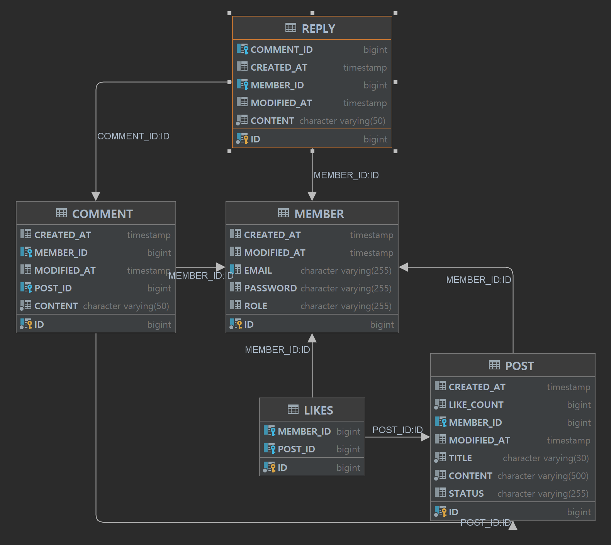

# [1st project ] be-dashboard


## Introduction

---

기본적인 백엔드 웹 개발 흐름을 파악하고 스스로 문제를 정의, 해결하며 팀원들과 소통하기 위한 미니 프로젝트
- **진행기간**:  2024.9.22 ~ 2024.9.26
- **진행 방식**
  - 프론트가 구현된 게시판 깡통 web page가 제공되고, 해당 web Page가 필요한 API를 구현한다.
    - https://github.com/08month-team-project/fe-dashboard
- 프로젝트 전체 방향성
  - 실제 동작하는 걸 보여주고, 직접 구현함으로써 흥미를 최대한 가져간다. 
  - 코드 개발 이외의 테스팅 툴이나 협업, 비즈니스 문제를 정의하는 능력도 배양한다.

## Feature

---

### ⭐️ 회원
- #### 회원가입
  - 이메일과 비밀번호를 받아서 사용자 등록
    - 동일한 이메일을 가진 기존 사용자가 존재하는지 검증 
    - 비밀번호는 암호화 하여 저장
- #### 로그인
  - 로그인시 username(email) 값을 기반으로 만든 jwt 를 발급
    - 발급 받은 jwt를 프론트에서 저장한 뒤 인증이 필요한 url 요청시에 서버로 전송 
    - 구현한 jwt 관련 필터를 통해서 인증
      - 인증 실패시 401, 에러코드 반환
    - ###### 시간관계상 access token 발급만 구현하였다.
- #### 로그아웃 (인증)
  - ###### 컨트롤러만 만들어놓았다. <br>재발급 등의 기능을 제외한 점, 프론트에서 로그아웃시 발급받았던 jwt를 로컬스토리지로부터 비우는 방식으로 구현했기때문에 딱히 백엔드에서 구현할 로직이 필요하지 않다고 판단 

### ⭐️ 게시글
- #### 게시글 등록 (인증)
  - 제목과 본문 내용, 인증을 통한 정보로 게시글 등록
- #### 게시글 수정 (인증)
  - 제목과 본문 내용, 인증을 통한 정보로 게시글 수정
    - 요청에서 받은 id로 게시글을 찾을 수 없을 시 404 와 에러코드 반환
    - 인증을 거친 사용자가 해당 게시글 작성자가 아닐 시 403 과 에러코드 반환
- #### 게시글 일반조회
    - 등록돼있는 게시글을 페이징 처리하여 조회
      - 최신순으로 정렬
      - 페이지 사이즈는 10으로 고정
- #### 게시글 검색
  - 이메일을 통해 해당 이메일의 사용자가 작성한 게시글 조회
    - 페이징 방식은 일반조회와 동일
- #### 게시글 상세
  - 요청에서 받은 id를 가진 게시글이 존재하지 않을 시 404 와 에러코드 반환
  
### ⭐️ 댓글
###### 공통: 게시글 id를 통해 해당 게시글을 찾을 수 없는 경우 404 와 에러코드 반환
- #### 댓글 & 답글 작성 (인증)
  - 인증을 통한 정보로 댓글 작성
- #### 댓글 수정 (인증)
  - 인증정보와 댓글등록자가 다른경우 403, 에러코드 반환
- #### 댓글 삭제 (인증)
  - 인증정보와 댓글등록자가 다른경우 403, 에러코드 반환
- #### 댓글 조회
  - 특정 게시글이 보유한 댓글 목록을 조회

### ⭐️ 좋아요 (추가 기능) - 미구현


## Stack

---


[//]: # (스프링 관련)


[//]: # (데이터베이스 관련)


[//]: # (깃 관련)


[//]: # (노션)


[//]: # (테스트 관련)


[//]: # (인텔리제이)


## Architecture

---

### Package structure


```
src
├─main
│  ├─java
│  │  └─project_1st_team03
│  │      └─dashboard
│  │          ├─domain
│  │          │  ├─comment
│  │          │  │  ├─api
│  │          │  │  ├─application
│  │          │  │  ├─dao
│  │          │  │  ├─domain
│  │          │  │  ├─dto
│  │          │  │  └─exception
│  │          │  └─post
│  │          │      ├─api
│  │          │      ├─application
│  │          │      ├─dao
│  │          │      ├─domain
│  │          │      ├─dto
│  │          │      └─exception
│  │          └─global
│  │              ├─config
│  │              ├─exception
│  │              └─security

```
도메인 기준으로 패키지 계층을 분리하였다.
- ### domain
  - #### api
    - ###### Controller
  - #### application
    - ###### Service
  - #### dao
    - ###### Repository (Data Access Object)
  - #### domain
    - ###### Entity
  - #### dto
    - ###### Data Transfer Object 클래스
  - #### exception
    - ###### 도메인 별 커스텀 예외클래스 

- ### global
  - #### config
    - ###### 설정관련 클래스
  - #### exception
    - ###### 전역 에러 처리 핸들러
    - ###### 에러코드
    - ###### 에러응답 클래스
  - #### security
    - ###### jwt 관련 인증 필터
    - ###### 인증 관련 에러 처리 관련 클래스

현재 프로젝트에는 계층형이 적절할 수도 있었겠으나 지금보다 규모가 커질 2,3 차 프로젝트에 사용할 가능성이 높은 도메인 기준으로 작업하는 것에 익숙해지기 위한 선택이었다. 


## Erd

---




## Member

---


| 이름           | 역할         | Github |
|--------------|------------|---|
| 유도경  | 회원 , 게시글 구현 | https://github.com/DokyungYou  |
| 임승진          | 댓글     구현  | https://github.com/TestSeung  |
| 안재혁          | 좋아요   구현   | https://github.com/AhnJaeHyeok  |


### 소감

- **유도경**
: 백엔드코드에 집중하고, 테스트코드도 제대로 했어야했는데, 결국 제공된 프론트 코드를 고치는데 기간의 거의 반이나 쓴 것 같습니다.<br/> 
아직 백엔드가 많이 부족해서 투자해야할 시간이 많은데 아직 알지도 못하는 리액트 수정하느라 너무 고역이었습니다.<br/>
주어진 기간이 짧기때문에 프론트는 ai를 사용해서 빨리 진행하고 백엔드에 더 집중하고 싶었으나 사용메세지 제한 때문에 ai도 못쓰고 진행해서 힘들었습니다.<br/>
2, 3차 들어가기 전에 필수로 필요한 지식들을 익히면서 진행하고싶었는데, 많이 아쉽습니다. 

  
  
- **임승진**
  - 직접 코드를 다루며 이론을 쌓을 수 있었고 재미가 있었습니다.


- **안재혁**
  - 이번 프로젝트에 많이 참석하지 못해 아쉬운 점도 있었지만, 팀원들이 목표를 향해 나아가는 과정을 지켜보면서 많은 것을 배울 수 있었습니다.<br>
  특히, 프로젝트의 진행 방식과 팀의 협업 과정에서 배운 점들이 앞으로 성장하는 데 큰 도움이 될 것 같습니다.<br>
  직접적으로 기여하지는 못했지만, 그동안 지켜보면서 얻은 경험은 저에게 큰 경험이 되었습니다.<br>
  이번 프로젝트에서 하지 못한 부분들은 앞으로 꼭 완료할 계획입니다.
